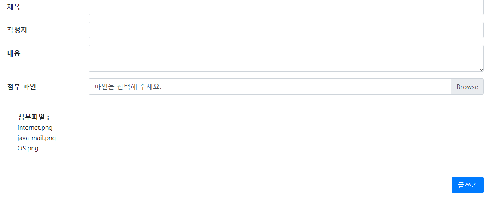

# Spring File Upload

`Spring Boot` + `Thymeleaf`

코드와 주석 위주로 작성하였습니다.

파일 업로드 테스트에 초점을 맞춰 작성해본 코드로 에러 발생 시 댓글 남겨주시면 대단히 감사하겠습니다..! 😊🎉

---

## Add Dependency

- [Apache Commons](http://commons.apache.org/)
  - [Commons IO](http://commons.apache.org/proper/commons-io/) : to assist with developing IO functionality.
  - [Commons FileUpload](http://commons.apache.org/proper/commons-fileupload/)

```xml
<!-- ... -->
    <!-- File Upload (대용량 파일 처리) -->
    <!-- https://mvnrepository.com/artifact/commons-io/commons-io -->
    <dependency>
        <groupId>commons-io</groupId>
        <artifactId>commons-io</artifactId>
        <version>2.6</version>
    </dependency>
    <!-- File Upload (file upload 기능 사용) -->
    <!-- https://mvnrepository.com/artifact/commons-fileupload/commons-fileupload -->
    <dependency>
        <groupId>commons-fileupload</groupId>
        <artifactId>commons-fileupload</artifactId>
        <version>1.3.1</version>
    </dependency>
<!-- ... -->
```

**pom.xml** (all view)

```xml
<!-- All dependency -->
    <!-- h2database -->
    <dependency>
        <groupId>com.h2database</groupId>
        <artifactId>h2</artifactId>
        <scope>runtime</scope>
    </dependency>

    <!-- lombok -->
    <dependency>
        <groupId>org.projectlombok</groupId>
        <artifactId>lombok</artifactId>
        <scope>provided</scope>
    </dependency>

    <!-- JPA -->
    <dependency>
        <groupId>org.springframework.boot</groupId>
        <artifactId>spring-boot-starter-data-jpa</artifactId>
    </dependency>

    <!-- File Upload (대용량 파일 처리) -->
    <dependency>
        <groupId>commons-io</groupId>
        <artifactId>commons-io</artifactId>
        <version>2.6</version>
    </dependency>
    <!-- File Upload (file upload 기능 사용) -->
    <dependency>
        <groupId>commons-fileupload</groupId>
        <artifactId>commons-fileupload</artifactId>
        <version>1.3.1</version>
    </dependency>

    <!-- Jackson Library -->
    <dependency>
        <groupId>com.fasterxml.jackson.core</groupId>
        <artifactId>jackson-databind</artifactId>
    </dependency>
    <dependency>
        <groupId>com.fasterxml.jackson.core</groupId>
        <artifactId>jackson-annotations</artifactId>
    </dependency>

    <!-- junit -->
    <dependency>
        <groupId>junit</groupId>
        <artifactId>junit</artifactId>
        <scope>test</scope>
    </dependency>

    <dependency>
        <groupId>org.springframework.boot</groupId>
        <artifactId>spring-boot-configuration-processor</artifactId>
        <optional>true</optional>
    </dependency>

    <!-- https://mvnrepository.com/artifact/com.google.code.gson/gson -->
    <dependency>
        <groupId>com.google.code.gson</groupId>
        <artifactId>gson</artifactId>
    </dependency>
<!-- ... -->
```

---

## Set Properties

```properties
# total file size cannot exceed 10MB.
spring.servlet.multipart.max-file-size=10MB
# total request size for a multipart/form-data cannot exceed 20MB.
spring.servlet.multipart.max-request-size=20MB
```

**application.properties** (all view)

```properties
### PORT setting
server.port = 8999

### datasource Setting
spring.datasource.url=jdbc:h2:tcp://localhost/~/test
spring.datasource.driver-class-name=org.h2.Driver
spring.datasource.username=sa
spring.datasource.password=sa
spring.h2.console.enabled=true

### JPA Query Setting
spring.jpa.properties.hibernate.show_sql=true
spring.jpa.properties.hibernate.format_sql=true
spring.jpa.properties.hibernate.use_sql_comments=true
logging.level.org.hibernate.type.descriptor.sql=trace

### File Upload Setting
# total file size cannot exceed 10MB.
spring.servlet.multipart.max-file-size=10MB
# total request size for a multipart/form-data cannot exceed 20MB.
spring.servlet.multipart.max-request-size=20MB

# Logger Setting
logging.level.root=INFO
```

---

## Config

Spring Audit 기능을 활용하여 도메인들이 공통적으로 가지고 있는 필드 처리

**JpaConfig.java**

```java
@Configuration
@EnableJpaAuditing // JPA Auditing 활성화
public class JpaConfig {
}
```

---

## Domain

**BaseTimeEntity.java**

```java
/**
 * 모든 Entity의 상위 클래스
 * Entity들의 생성시간, 수정시간을 자동으로 관리
 *
 * @MappedSuperclass : 상속 클래스들이 부모 클래스의 컬럼을 인식하도록 설정
 * @EntityListeners(AuditingEntityListener.class) : Auditing 기능
 */
@Getter
@MappedSuperclass
@EntityListeners(AuditingEntityListener.class)
public abstract class BaseTimeEntity {

    @CreatedDate
    private LocalDateTime createdDateTime;

    @LastModifiedDate
    private LocalDateTime modifiedDateTime;
}
```

**GalleryDto.java**

```java
public class GalleryDto {

    @Getter
    @NoArgsConstructor
    public static class Response {
        private Long id;
        private String memberName;
        private String title;
        private String contents;
        private LocalDateTime createdDateTime;


        public Response(Gallery entity) {
            this.id = entity.getId();
            this.memberName = entity.getMemberName();
            this.title = entity.getTitle();
            this.contents = entity.getContents();
            this.createdDateTime = entity.getCreatedDateTime();
        }
    }

    @Getter
    public static class ListResponse {
        private Long id;
        private String member;
        private String title;

        public ListResponse(Gallery entity) {
            this.id = entity.getId();
            this.member = entity.getMemberName();
            this.title = entity.getTitle();
        }
    }
}
```

---

## Entity

**Gallery.java**

```java
@Getter
@Setter
@NoArgsConstructor(access = AccessLevel.PUBLIC)
@Entity(name="Gallery")
@Table(name="GALLERY")
public class Gallery extends BaseTimeEntity {

    @Id
    @GeneratedValue(strategy=GenerationType.IDENTITY)
    @Column(name="GALLERY_ID")
    private Long id;

    @Column(name = "MEMBER_NAME", nullable = false, updatable = false)
    private String memberName;

    @Column(nullable = false)
    private String title;

    @Column(nullable = false)
    private String contents;

    @OneToMany(mappedBy="gallery", cascade = {CascadeType.PERSIST, CascadeType.MERGE, CascadeType.REMOVE})
    private List<Attachments> attachmentsList = new ArrayList<>();
}
```

**Member.java**

```java
@Getter
@NoArgsConstructor
@Entity(name="Member")
@Table(name = "MEMBER")
public class Member extends BaseTimeEntity {

    @Id
    @GeneratedValue(strategy = GenerationType.IDENTITY)
    @Column(name = "MEMBER_ID", unique = true, nullable = false)
    private Long id;

    @Column(length = 15, nullable = false)
    private String name;

    @Column(length = 100, nullable = false)
    private String password;

    @Column(length = 50, nullable = false)
    private String email;

    @Column(length = 20, nullable = false)
    private String contact;

    @Builder
    public Member(String name, String password, String email, String contact) {
        this.name = name;
        this.password = password;
        this.email = email;
        this.contact = contact;
    }
}
```

**Attachments.java**

```java
@Getter
@NoArgsConstructor(access = AccessLevel.PUBLIC)
@Entity(name="Attachments")
@Table(name="ATTACHMENTS")
public class Attachments extends BaseTimeEntity {

    @Id
    @GeneratedValue(strategy = GenerationType.IDENTITY)
    @Column(name = "ATTACHMENTS_ID")
    private Long id;

    @ManyToOne
    @JoinColumn(name = "GALLERY_ID")
    private Gallery gallery;

    @Column(nullable = false)
    private String origFileName;

    @Column(nullable = false)
    private String fileName;

    @Column(nullable = false)
    private String filePath;

    private Long fileSize;

    @Builder
    public Attachments(Gallery gallery, String origFileName, String fileName, String filePath, Long fileSize) {
        this.gallery = gallery;
        this.origFileName = origFileName;
        this.fileName = fileName;
        this.filePath = filePath;
        this.fileSize = fileSize;
    }

    public void setGallery(Gallery gallery) {
        this.gallery = gallery;
    }
}
```

---

## Exception

**FileException.java**

```java
// serialVersionUID를 정의해주지 않은 경우 나타나는 warnning을 체크하지 않음
@SuppressWarnings("serial")
public class FileException extends RuntimeException {

    public FileException(String message) {
        super(message);
    }

    public FileException(String message, Throwable cause) {
        super(message, cause);
    }
}
```

---

## Repository

**AttachmentsRepository.java**

```java
public interface AttachmentsRepository extends JpaRepository<Attachments, Long> {

    /**
     * Find attachments by the gallery ID
     *
     * @param galleryId
     * @return
     */
    public List<Attachments> findAllByGalleryId(Long galleryId);

    /**
     * Delete attachments by the delete file list
     *
     * @param deleteFileList
     */
    @Modifying
    @Query(value = "DELETE FROM Attachments a " +
                  "WHERE a.id IN (:deleteFileList)")
    public void deleteByAttachIdList(@Param("deleteFileList") List<Long> deleteFileList);
}
```

**GalleryRepository.java**

```java
public interface GalleryRepository extends JpaRepository<Gallery, Long> {

    List<Gallery> findAllByOrderByIdDesc();
}
```

**MemberRepository.java**

```java
public interface MemberRepository extends JpaRepository<Member, Long> {

    @Query("SELECT m "
            + "FROM Member m "
            + "WHERE m.name = :name")
    Optional<Member> findByName(@Param("name") String name);
}
```

---

## Service

**GalleryServiceImpl.java**

```java
@RequiredArgsConstructor
@Service
@Getter
public class GalleryServiceImpl {

    private final GalleryRepository galleryRepository;
    private final AttachmentsRepository attachmentsRepository;

    @Transactional(readOnly = true)
    public GalleryDto.Response searchById(Long id) {

        Gallery entity = galleryRepository.findById(id).orElseThrow(()
                -> new IllegalArgumentException("해당 게시물이 존재하지 않습니다."));

        return new GalleryDto.Response(entity);
    }

    @Transactional(readOnly = true)
    public List<GalleryDto.ListResponse> searchAllDesc() {

        return galleryRepository.findAllByOrderByIdDesc().stream()
                .map(GalleryDto.ListResponse::new)
                .collect(Collectors.toList());
    }

    @Transactional
    public void delete(Long id){

        Gallery gallery = galleryRepository.findById(id)
                .orElseThrow(()->new IllegalArgumentException("해당 게시물이 존재하지 않습니다."));

        galleryRepository.delete(gallery);
    }


    @Transactional
    public Long save(Gallery gallery, List<MultipartFile> files, List<Long> deleteFileList) throws Exception {

        Gallery saveGallery = getGalleryRepository().save(gallery);

        List<Attachments> AttachmentsList = FileUtilities.parseFileInfo(files, saveGallery);

        // 파일이 존재할 경우
        if (!AttachmentsList.isEmpty()) {
            AttachmentsList.forEach(attachments -> attachmentsRepository.save(attachments));
        }

        // 삭제할 파일이 존재할 경우
        if (!deleteFileList.isEmpty()) {
            attachmentsRepository.deleteByAttachIdList(deleteFileList);
        }

        return saveGallery.getId();
    }
}
```

**MemberServiceImpl.java**

```java
@RequiredArgsConstructor
@Service
@Getter
public class MemberServiceImpl {

    private final MemberRepository memberRepository;

    @Transactional(readOnly = true)
    public Member searchByName(String name) {

        Member member = memberRepository.findByName(name).orElseThrow(()
                -> new IllegalArgumentException("존재하지 않는 회원입니다."));

        return member;
    }
}
```

---

## Utility

**FileUtilities.java**

```java
public class FileUtilities {

    // Paths.get()으로 운영체제에 따라서 다른 파일구분자 처리
    public final static String rootPath = Paths.get("C:", "Users", "jihun.park", "Desktop", "testFile").toString();

    /**
     * MultipartFile 형태의 파일을 Attachments Entity 형태로 파싱
     *
     * @param multipartFiles
     * @param gallery
     */
    public static List<Attachments> parseFileInfo(List<MultipartFile> multipartFiles, Gallery gallery) throws Exception {

        // 파일이 첨부되지 않았을 경우
        if (CollectionUtils.isEmpty(multipartFiles)) {
            return Collections.emptyList();
        }

        // 파일 업로드 경로 생성
        String savePath = Paths.get(rootPath, "files").toString();
        if (!new File(savePath).exists()) {
            try {
                new File(savePath).mkdir();
            } catch (Exception e) {
                e.getStackTrace();
            }
        }

        List<Attachments> fileList = new ArrayList<>();

        for (MultipartFile multipartFile : multipartFiles) {

            String origFilename = multipartFile.getOriginalFilename();
            if (origFilename == null || "".equals(origFilename)) continue;
            String filename = MD5Generator(FilenameUtils.getBaseName(origFilename)).toString() + "." + FilenameUtils.getExtension(origFilename);
            String filePath = Paths.get(savePath, filename).toString();

            Attachments attachments = new Attachments(gallery,
                                                    multipartFile.getOriginalFilename(),
                                                    filename,
                                                    filePath,
                                                    multipartFile.getSize());

            fileList.add(attachments);

            try {
                File file = new File(filePath);
                multipartFile.transferTo(file);

                // 파일 권한 설정(쓰기, 읽기)
                file.setWritable(true);
                file.setReadable(true);

            } catch (IOException e) {
                throw new FileException("[" + multipartFile.getOriginalFilename() + "] failed to save file...");

            } catch (Exception e) {
                throw new FileException("[" + multipartFile.getOriginalFilename() + "] failed to save file...");
            }
        }

        return fileList;
    }

    /**
     * 다운로드 받을 파일 생성
     *
     * @param attach
     */
    public static File getDownloadFile(Attachments attach) {

        return new File(Paths.get(rootPath, "files").toString(), attach.getFileName());
    }

    /**
     * 파일명 중복 방지를 위해 MD5(128비트 암호화 해시 함수) 파일명 생성
     *
     * @param input
     */
    public static String MD5Generator(String input) throws UnsupportedEncodingException, NoSuchAlgorithmException {

        MessageDigest mdMD5 = MessageDigest.getInstance("MD5");
        mdMD5.update(input.getBytes("UTF-8"));

        byte[] md5Hash = mdMD5.digest();
        StringBuilder hexMD5hash = new StringBuilder();

        for(byte b : md5Hash) {
            String hexString = String.format("%02x", b);
            hexMD5hash.append(hexString);
        }

        return hexMD5hash.toString();
    }

    /**
     * MediaType 생성
     *
     * @param filename
     */
    public static MediaType getMediaType(String filename) {

        String contentType = FilenameUtils.getExtension(filename);
        MediaType mediaType = null;

        if (contentType.equals("png")) {
            mediaType = MediaType.IMAGE_PNG;
        } else if (contentType.equals("jpeg") || contentType.equals("jpg")) {
            mediaType = MediaType.IMAGE_JPEG;
        } else if (contentType.equals("gif")) {
            mediaType = MediaType.IMAGE_GIF;
        }

        return mediaType;
    }
}
```

---

## Controller

**GalleryApiController.java**

```java
@RequiredArgsConstructor
@RestController
public class GalleryApiController {

    private static final Logger LOGGER = LoggerFactory.getLogger(GalleryApiController.class);

    private final GalleryServiceImpl galleryService;
    private final MemberServiceImpl memberService;

    /**
     * 게시물 삭제
     *
     * @param galleryId
     */
    @PostMapping("/gallery/delete")
    public void deleteGallery(@RequestParam("galleryId") Long galleryId){

        // 관리자 or 작성자가 아닐 경우 삭제 불가 로직

        galleryService.delete(galleryId);
    }

    /**
     * 게시물 저장
     *
     * @param multiRequest
     * @return
     * @throws Exception
     */
    @PostMapping("/gallery")
    @ResponseStatus(HttpStatus.CREATED)
    public String saveGallery(MultipartHttpServletRequest multiRequest) throws Exception {

        LOGGER.debug(multiRequest.getParameter("id"));
        JsonObject jsonObject = new JsonObject();

        // 작성자 정보 확인
        Optional<Member> optMember = memberService.getMemberRepository().findByName(multiRequest.getParameter("memberName"));
        if (!optMember.isPresent()) {
            jsonObject.addProperty("response", "error");
            jsonObject.addProperty("errorMsg", "사용자 정보를 찾을 수 없습니다.");

            return jsonObject.toString();
        }

        Gallery gallery = new Gallery();
        List<Long> deleteFileList = new ArrayList<>();

        // 신규 등록
        if (multiRequest.getParameter("id") == null) {
            gallery.setMemberName(multiRequest.getParameter("memberName"));
            gallery.setTitle(multiRequest.getParameter("title"));
            gallery.setContents(multiRequest.getParameter("contents"));
        }
        // 수정
        else {
            Optional<Gallery> optGallery = galleryService.getGalleryRepository().findById(Long.parseLong(multiRequest.getParameter("id")));
            if (!optGallery.isPresent()) {
                jsonObject.addProperty("response", "error");
                jsonObject.addProperty("errorMsg", "게시물 정보를 찾을 수 없습니다.");

                return jsonObject.toString();
            }

            gallery = optGallery.get();
            gallery.setTitle(multiRequest.getParameter("title"));
            gallery.setContents(multiRequest.getParameter("contents"));

            if (!"".equals(multiRequest.getParameter("deleteFiles"))) {
                deleteFileList = Arrays.asList(multiRequest.getParameter("deleteFiles").split(",")).stream()
                                            .map(s -> Long.parseLong((String) s)).collect(Collectors.toList());
            }
        }

        Long id = galleryService.save(gallery, multiRequest.getFiles("files"), deleteFileList);

        jsonObject.addProperty("response", "OK");
        jsonObject.addProperty("galleryId", id);

        return jsonObject.toString();
    }

    /**
     * 첨부 파일 다운로드
     *
     * @param id
     * @param response
     */
    @GetMapping("/gallery/download/{id}")
    public void downloadAttach(@PathVariable Long id, HttpServletResponse response){

        Optional<Attachments> optAttach = galleryService.getAttachmentsRepository().findById(id);
        if (!optAttach.isPresent()) {
            throw new RuntimeException("파일을 찾을 수 없습니다.");
        }

        Attachments attach = optAttach.get();
        File file = FileUtilities.getDownloadFile(attach);

        try {
            byte[] data = FileUtils.readFileToByteArray(file);

            response.setContentType(FileUtilities.getMediaType(attach.getOrigFileName()).toString());
            response.setContentLength(data.length);
            response.setHeader("Content-Transfer-Encoding", "binary");
            response.setHeader("Content-Disposition", "attachment; fileName=\"" + URLEncoder.encode(attach.getOrigFileName(), "UTF-8") + "\";");

            response.getOutputStream().write(data);
            response.getOutputStream().flush();
            response.getOutputStream().close();

        } catch (IOException e) {
            throw new RuntimeException("파일 다운로드에 실패하였습니다.");
        } catch (Exception e) {
            throw new RuntimeException("시스템에 문제가 발생하였습니다.");
        }
    }
}
```

**GalleryController.java**

```java
@Controller
@RequestMapping("/gallery")
public class GalleryController {

    @Autowired private GalleryServiceImpl galleryService;

    /**
     * View Gallery
     *
     * @param id
     * @param model
     * @return
     */
    @GetMapping("/{id}")
    public String searchById(@PathVariable Long id, Model model) {

        model.addAttribute("gallery", galleryService.searchById(id));
        model.addAttribute("fileList", galleryService.getAttachmentsRepository().findAllByGalleryId(id));

        return "gallery/viewGallery";
    }

    /**
     * Move Gallery Edit Page
     *
     * @param model
     * @return
     */
    @GetMapping("/edit")
    public String newGallery(Model model) {

        model.addAttribute("gallery", new GalleryDto.Response());

        return "gallery/editGallery";
    }

    /**
     * Edit Gallery
     *
     * @param id
     * @param model
     * @return
     */
    @GetMapping("/edit/{id}")
    public String editGallery(@PathVariable Long id, Model model) {

        // 관리자 or 작성자가 아닐 경우 수정 불가 로직

        model.addAttribute("gallery", galleryService.searchById(id));
        model.addAttribute("fileList", galleryService.getAttachmentsRepository().findAllByGalleryId(id));

        return "gallery/editGallery";
    }

    /**
     * Display Img
     *
     * @param id
     * @return
     * @throws Exception
     */
    @GetMapping(value = "/display")
    public ResponseEntity<byte[]> displayImgFile(@RequestParam("id") Long id)throws Exception{

        InputStream in = null;
        ResponseEntity<byte[]> entity = null;
        Optional<Attachments> optAttach = galleryService.getAttachmentsRepository().findById(id);
        if(!optAttach.isPresent()) {
            new RuntimeException("이미지 정보를 찾을 수 없습니다.");
        }

        Attachments attach = optAttach.get();

        try {
            HttpHeaders headers = new HttpHeaders();
            in = new FileInputStream(attach.getFilePath());
            headers.setContentType(FileUtilities.getMediaType(attach.getOrigFileName()));
            headers.add("Content-Disposition", "attachment; filename=\"" + new String(attach.getOrigFileName().getBytes("UTF-8"), "ISO-8859-1")+"\"");

            entity = new ResponseEntity<byte[]>(IOUtils.toByteArray(in), headers, HttpStatus.CREATED);

        } catch(Exception e) {
            e.printStackTrace();
            entity = new ResponseEntity<byte[]>(HttpStatus.BAD_REQUEST);
        } finally {
            in.close();
        }

        return entity;
    }
}
```

---

## View

`thymeleaf`

- Edit

```html
<!DOCTYPE html>
<html lang="ko" xmlns:th="http://www.thymeleaf.org">
<head>
    <meta charset="UTF-8">
    <title>File Upload Test</title>
    <link rel='stylesheet' href='/css/bootstrap.min.css'>
</head>
<style>
.btn-xs {
  padding: .25rem .4rem;
  font-size: .700rem;
  line-height: .7;
  border-radius: .2rem;
}
</style>
<body>
<div class="container">
    <form id="form" enctype="multipart/form-data" th:object="${gallery}" onsubmit="return false">
        <input type="hidden" id="id" th:if="*{id != null and id > 0}" th:field="*{id}" />
        <div class="form-group row">
            <label for="title" class="col-sm-2 col-form-label"><strong>제목</strong></label>
            <div class="col-sm-10">
                <input type="text" name="title" class="form-control" id="title" th:value="*{title}"></input>
            </div>
        </div>
        <div class="form-group row">
            <label for="memberId" class="col-sm-2 col-form-label"><strong>작성자</strong></label>
            <div class="col-sm-10">
                <input type="text" name="memberName" class="form-control" id="memberName" th:value="*{memberName}">
            </div>
        </div>
        <div class="form-group row">
            <label for="contents" class="col-sm-2 col-form-label"><strong>내용</strong></label>
            <div class="col-sm-10">
                <textarea name="contents" class="form-control" id="contents">[[*{contents}]]</textarea>
            </div>
        </div>
        <div class="form-group row">
            <label for="files" class="col-sm-2 col-form-label"><strong>첨부 파일</strong></label>
            <div class="col-sm-10">
                <div class="custom-file" id="inputFile">
                    <input name="files" id="files" type="file" multiple="multiple" class="custom-file-input">
                    <label class="custom-file-label" for="customFile">파일을 선택해 주세요.</label>
                </div>
            </div>
            <div id="fileList" style="margin:40px;">
                <strong>첨부파일 : </strong>
                <br>
                <div id=uploadFileList>
                </div>
            </div>
            <br>
            <div th:if="${not #lists.isEmpty( fileList )}">
                <div id="fileList" style="margin:40px;">
                    <strong>기존 첨부파일 : </strong>
                    <div th:each="row, status : ${fileList}" >
                        
                        <a th:href="@{'/gallery/download/' + ${row.id}}" th:text="${row.origFileName}"></a>
                        &nbsp;<button type="button" onclick="deleteFile(this)" th:value="${row.id}" class="btn btn-danger btn-xs">X</button>
                    </div>
                </div>
            </div>
        </div>
        <div class="row">
            <div class="col-auto mr-auto"></div>
            <div class="col-auto">
                <input class="btn btn-primary" type="submit" id="btnSave" role="button" value="글쓰기">
            </div>
        </div>
    </form>
</div>
<script src="/js/jquery-3.6.0.min.js"></script>
<script src="/js/bootstrap.min.js"></script>
<script type="text/javascript" th:inline="javascript">
/*<![CDATA[*/
$(function() {
    $("#files").on("change", function(e) {
        inputFile(e);
    });

    $("#btnSave").on("click", function() {
        saveGallery();
    });
});

var fileCount = 0;
var totalCount = 10;
var fileNum = 0;
var inputFileList = new Array();
var deleteFileList = new Array();

function inputFile(e) {

    var files = e.target.files;

    var filesArr = Array.prototype.slice.call(files);

    if (fileCount + filesArr.length > totalCount) {
        alert('파일은 최대 ' + totalCount + '개까지 업로드 할 수 있습니다.');
        return;
    } else {
        fileCount = fileCount + filesArr.length;
    }

    filesArr.forEach(function(f) {
        var reader = new FileReader();
        reader.onload = function(e) {
            inputFileList.push(f);
            $('#uploadFileList').append('<div id="file' + fileNum + '" onclick="fileDelete(\'file' + fileNum + '\')">' + '<font style="font-size:15px">' + f.name + '</font><div/>');
            fileNum++;
        };
        reader.readAsDataURL(f);
    });
    $("#files").val("");
}

function deleteFile(elem) {

    console.log(elem.value);
    $(elem).parent().remove();

    if (!deleteFileList.includes(elem.value)) {
        deleteFileList.push(elem.value);
    }
}

function fileDelete(fileNum) {

    var no = fileNum.replace(/[^0-9]/g, "");
    inputFileList[no].is_delete = true;
    $('#' + fileNum).remove();
    fileCount--;
}


function saveGallery() {

     var formData = new FormData($("form")[0]);

    formData.append("deleteFiles", deleteFileList);

    for (var i = 0; i < inputFileList.length; i++) {
        if(!inputFileList[i].is_delete){
             formData.append("files", inputFileList[i]);
        }
    }

    $.ajax({
        type : "POST",
        enctype : "multipart/form-data",
        url : "/gallery",
        data : formData,
        dataType:"json",
        processData : false,
        contentType : false,
        success : function(result) {
            console.log(result);
            if (result.response == "OK") {
                if ($("#id").val() == undefined) {
                    alert("저장되었습니다.");
                } else {
                    alert("수정되었습니다.");
                }

                location.href = "/gallery/edit/" + result.galleryId;
            } else {
                alert(result.errorMsg);
            }
        },
    });
}
/*]]>*/
</script>
</body>
</html>
```

- View

```html
<!DOCTYPE html>
<html lang="ko" xmlns:th="http://www.thymeleaf.org">
  <head>
    <meta charset="UTF-8" />
    <title th:text="@{'게시판 - ' + ${gallery.title}}"></title>
    <link rel="stylesheet" href="/css/bootstrap.min.css" />
  </head>
  <body>
    <div class="container">
      <div class="card">
        <div class="card-body">
          <h5
            class="card-title"
            th:text="@{${gallery.title} + ' - ' + ${gallery.memberName}}"
          ></h5>
          <p class="card-text">
            <small
              class="text-muted"
              th:text="${#temporals.format(gallery.createdDateTime, 'yyyy-MM-dd HH:mm')}"
            ></small>
          </p>
          <p class="card-text" th:text="${gallery.contents}"></p>
          <div th:if="${not #lists.isEmpty( fileList )}">
            <strong>첨부파일 : </strong>
            <div th:each="row, status : ${fileList}" class="card-text">
              
              <a
                th:href="@{'/gallery/download/' + ${row.id}}"
                th:text="${row.origFileName}"
              ></a>
            </div>
          </div>
        </div>
      </div>
      <div class="row mt-3">
        <div class="col-auto mr-auto"></div>
        <div class="col-auto">
          <a
            class="btn btn-info"
            th:href="@{'/gallery/edit/' + ${gallery.id}}"
            role="butEdit"
            >수정</a
          >
        </div>
        <div class="col-auto">
          <form id="delete-form" th:action="@{'/gallery/delete'}" method="post">
            <input type="hidden" name="galleryId" th:value="${gallery.id}" />
            <button id="delete-btn" type="submit" class="btn btn-danger">
              삭제
            </button>
          </form>
        </div>
      </div>
    </div>
    <script src="/js/jquery-3.6.0.min.js"></script>
    <script src="/js/bootstrap.min.js"></script>
    <script type="text/javascript" th:inline="javascript">
      /*<![CDATA[*/
      /*]]>*/
    </script>
  </body>
</html>
```

## Result



## Reference

> [https://congsong.tistory.com/39?category=749196](https://congsong.tistory.com/39?category=749196)
>
> [https://tyrannocoding.tistory.com/54](https://tyrannocoding.tistory.com/54)
>
> [https://congsong.tistory.com/45?category=749196](https://congsong.tistory.com/45?category=749196)

## Guide

> [Uploading Files](https://spring.io/guides/gs/uploading-files/)

## Project Code

> [Github](https://github.com/jihunparkme/blog/tree/main/projects/SpringFileUpload/demo)
