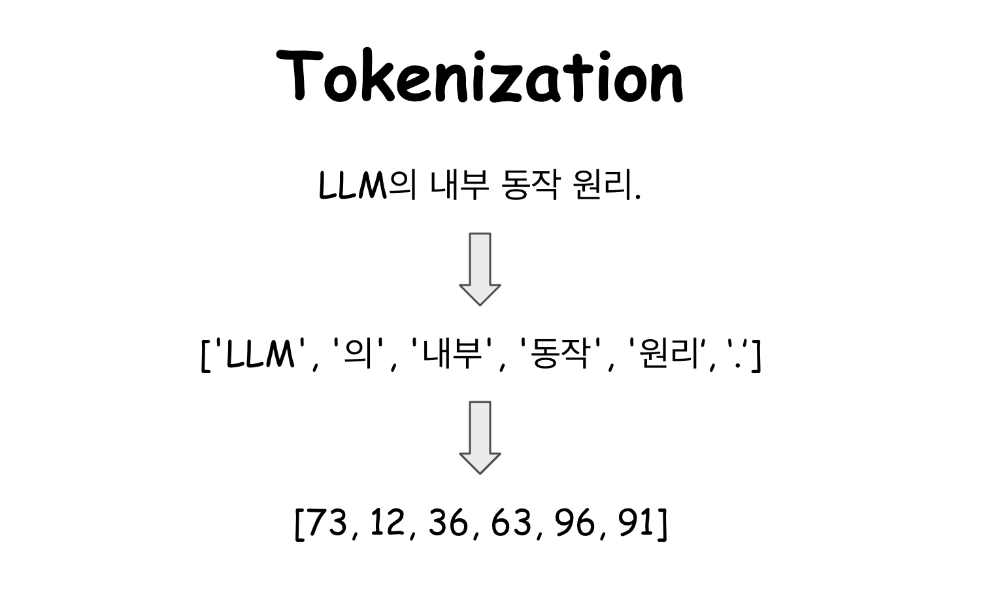
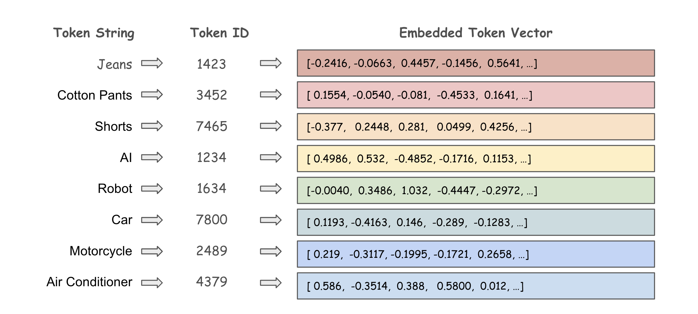
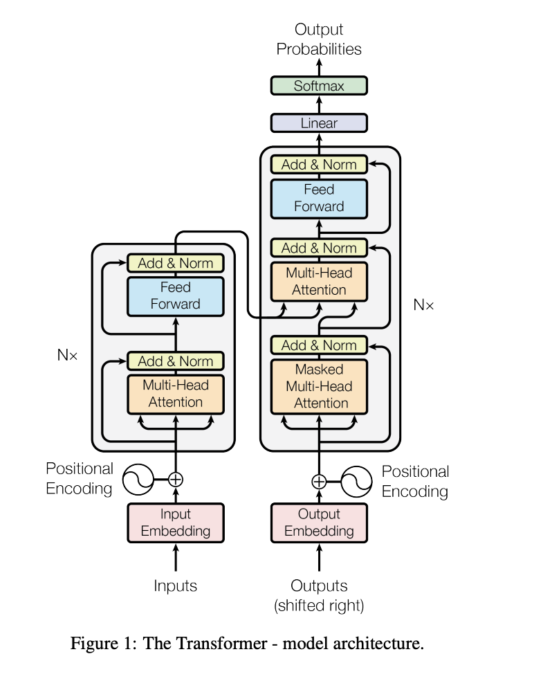
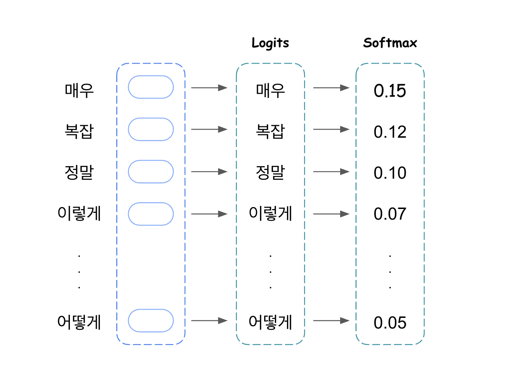
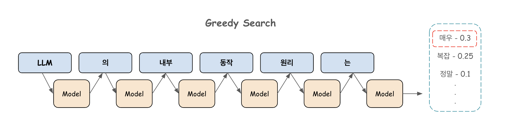
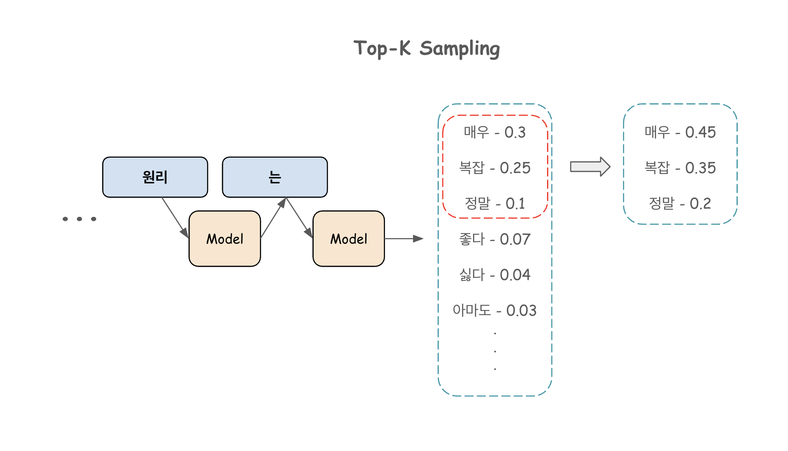
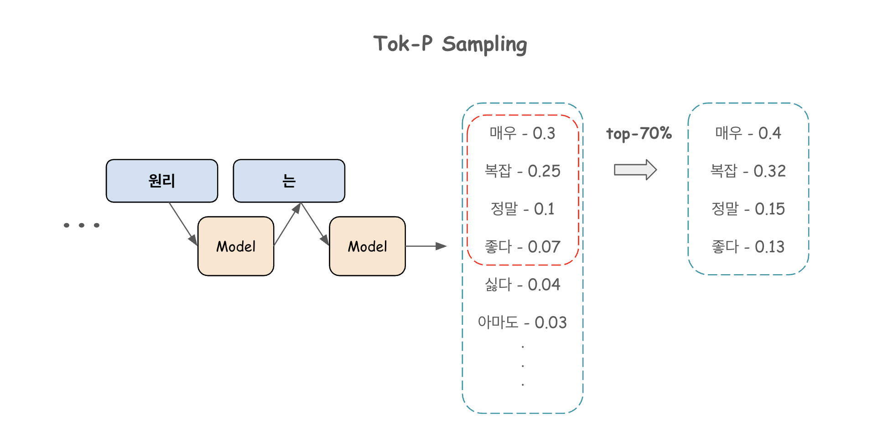
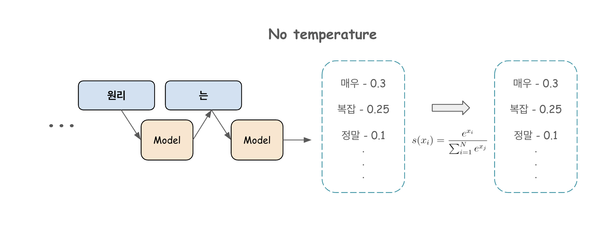
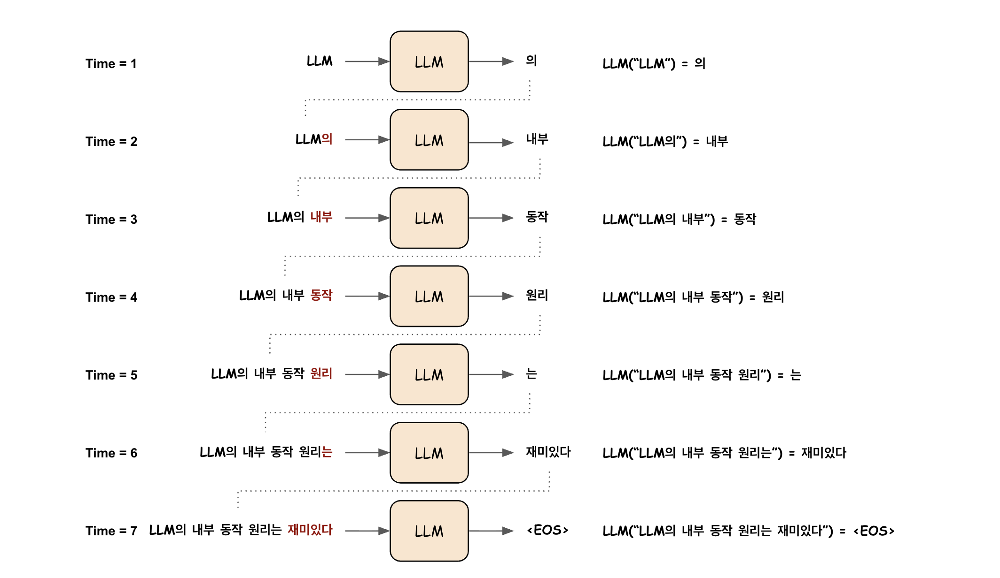

# 비전문가가 궁금해서 살짝(?) 파본 LLM 내부 동작 원리 

해당 글은 LLM을 사용하고 있는 비전문가인 백엔드 개발자의 관점에서 작성된 글로, LLM 전문가의 시각과는 다를 수 있습니다.  
내용 중 오류를 발견하시면 언제든 피드백 부탁드립니다.

## LLM 내부 동작 원리 6단계

- 1단계: `Tokenization` (프롬프트를 토큰으로 분리하고 고유 ID 매핑하기)
- 2단계: `Embedding` (토큰화된 숫자 ID를 의미를 가진 벡터로 변환하기)
- 3단계: `Positional Encoding` (단어의 순서를 파악하기 위해 위치 정보 더하기)
- 4단계: `Transformer & Attention` (문맥 관계를 파악하고 각 단어의 표현을 정제하기)
- 5단계: `Prediction` (다음 토큰 예측하기)
- 6단계: `Decoding & Loop` (디코딩 및 반복으로 문장 완성하기)

## 1단계: Tokenization

사용자의 프롬프트를 LLM이 이해할 수 있는 최소 단위인 **토큰(Token)** 으로 분리하는 단계입니다. 이 단계는 JSON 문자열을 파싱하여 객체로 만드는 것과 비슷합니다.
- 예를 들어, "LLM의 내부 동작 원리."라는 문장은 `['LLM', '의', '내부', '동작', '원리', '.']` 와 같이 의미 있는 단위로 분리
- 각 토큰은 고유한 정수 ID에 매핑 (예: `[73, 12, 36, 63, 96, 91]`)

<figure><figcaption></figcaption></figure>

### 토큰화

토큰화(Tokenization)는 LLM이 문장을 이해하기 위해 **의미 있는 최소 단위로 쪼개는 과정**입니다. 마치 문장을 읽을 때 단어 단위로 끊어 읽는 것과 같습니다. 하지만 LLM은 사람과 달라서, 사전에 없는 단어가 나오면 그 단어를 **더 작은 단위로 쪼개서 이해**합니다.
- 예를 들어 "인공지능"이라는 단어는 학습 데이터에 따라 "인공"과 "지능"이라는 두 개의 토큰으로 분리

Gemini의 경우 토큰화를 위해 [SentencePiece](https://github.com/google/sentencepiece)라는 tokenizer를 사용하고 있습니다. `SentencePiece`가 기존 tokenizer들과 다른 몇 가지의 중요한 차이점과 토큰이 고유한 정수 ID에 매핑되는 과정을 재현해 보겠습니다.
- **언어 중립적**: 공백을 기준으로 단어를 나누지 않고, 문장을 유니코드 문자들의 연속으로 보고, 가장 자주 함께 등장하는 글자들을 통계적으로 묶어 하나의 토큰으로 생성
  - 한국어처럼 조사가 단어에 붙어 쓰이거나 공백의 의미가 크지 않은 언어를 처리하는 데 매우 효과적
- **Subword 기반**: 어휘 사전에 없는 새로운 단어나 긴 단어가 나오면, 이를 더 작은 의미 단위(Subword)로 분해

#### 📝 Example

```python
# pip install sentencepiece
import sentencepiece as spm

# --- 훈련 데이터 준비 ---
training_data = """제미나이는 구글이 개발한 인공지능 언어 모델입니다.
LLM 내부 동작 원리가 궁금하지 않나요?
LLM 내부 동작 원리를 함께 알아보아요.
"""

with open("sample-data.txt", "w", encoding="utf-8") as f:
    f.write(training_data)

# --- 1. 모델 훈련 ---
# SentencePiece 모델 훈련
# 'sample_tokenizer.model', 'sample_tokenizer.vocab' 파일이 생성
spm.SentencePieceTrainer.train(
    '--input=sample-data.txt ' # 훈련시킬 데이터 파일
    '--model_prefix=sample_tokenizer ' # 생성될 모델 파일의 이름
    '--vocab_size=133 ' # 단어 집합의 크기 (어휘의 총 개수)
    '--model_type=bpe' # 모델 타입 (bpe, unigram ..)
)

# --- 2. 훈련된 모델로 토큰화 실행 ---
sp = spm.SentencePieceProcessor()

# 훈련된 모델 파일 로드
sp.load('sample_tokenizer.model')

# 테스트할 문장
sentence1 = "나는 LLM 내부 동작 원리를 공부한다."

# 문장을 토큰으로 분리
# _(언더바)기호는 띄어쓰기(공백)를 의미
tokens1 = sp.encode_as_pieces(sentence1)
print(tokens1) # ['▁', '나', '는', '▁LLM', '▁내부', '▁동작', '▁원리를', '▁', '공', '부', '한', '다', '.']

# 문장을 숫자 ID로 변환
ids1 = sp.encode_as_ids(sentence1)
print(ids1) # [89, 93, 113, 11, 8, 9, 44, 89, 107, 97, 131, 116, 91]

# 숫자 ID를 다시 문장으로 복원
decoded_sentence = sp.decode_ids(ids1)
print(decoded_sentence) # 나는 LLM 내부 동작 원리를 공부한다.
```

`SentencePieceTrainer.train()` 함수에서는 훈련 데이터 파일의 내용을 통계적으로 분석하여, 어떤 글자들을 한 묶음(토큰)으로 만들지 결정하고, 그 규칙을 분해 규칙 파일(`.model`)에 저장합니다. 어휘 사전 파일(`.vocab`)에는 생성된 토큰 목록과 그 점수가 저장됩니다.

```text
...
개발	-49
구글	-50
궁금	-51
내부	-52
동작	-53
리가	-54
리를	-55
...
```

### Training & Inference

이처럼 LLM이 실시간으로 요청이 들어올 때마다 사용자 입력을 훈련하지는 않고, 이 과정은 `훈련`(Training)과 `추론`(Inference)이라는 두 단계로 명확하게 나뉘어 동작합니다.

👉🏻 **Training Phase**
* 인공지능 언어 모델 개발사(Google, OpenAI 등)가 **단 한 번, 대규모로 수행하는 과정**
* 이 단계에서 수십 테라바이트에 달하는 방대한 텍스트 데이터로 토크나이저를 학습시켜 **완성된 'vocabulary(.vocab)'와 '모델(.model)'** 을 생성

👉🏻 **Inference Phase**
* **사용자가 질문을 할 때마다 일어나는** 동작
* LLM은 이미 만들어진 고정된 tokenizer를 **단순히 메모리에 로드**해서 사용
* 사용자의 문장을 이 규칙에 따라 즉시 토큰으로 변환하고 응답을 생성

### 모델 타입? BPE?, ULM?

`BPE`(Byte Pair Encoding)가 빈도수가 높은 문자 쌍을 병합하는 'Bottom-up' 방식이라면, `ULM`(Unigram Language Model)은 반대로 전체 단어에서 시작하여 중요도가 낮은 서브워드를 제거하는 'Top-down' 방식에 가깝습니다.

👉🏻 **BPE 기본 원리**
- 텍스트 내의 모든 개별 문자를 **초기 어휘**로 설정
- 현재 어휘로 구성된 텍스트에서 가장 빈번하게 함께 나타나는 **문자 쌍 찾기**
- 가장 빈번한 문자 쌍을 하나의 새로운 **서브워드 토큰으로 병합**(예: "l o w"에서 'o'와 'w'가 자주 나타나면 'ow'로 병합)
- 새로운 토큰을 어휘에 추가하고, 미리 정의된 어휘 크기에 도달하거나 더 이상 병합할 유의미한 쌍이 없을 때까지 **2단계와 3단계를 반복**

이 과정을 통해 자주 나타나는 문자 조합은 긴 서브워드가 되고, 희귀한 단어나 새로운 단어는 여러 개의 짧은 서브워드로 분리됩니다.

👉🏻 **ULM 기본 원리**
- 매우 큰 초기 **어휘 집합** 생성
- 각 서브워드 토큰이 텍스트에 나타날 확률을 계산(해당 서브워드의 빈도수 기반)
- 주어진 단어를 여러 서브워드로 분절할 수 있는 모든 가능한 경우의 수를 고려
  - "unigram"이라는 단어가 있다고 가정했을 때, un + igram, uni + gram, u + ni + gram 등 다양한 분절이 가능
  - 이 중 어떤 분절 조합이 가장 높은 확률을 가지는지 계산하여 선택
- 어휘 집합의 크기를 줄여나가는 과정
  - 전체 확률 분포에 미치는 영향이 가장 작은 서브워드를 제거
  - 이 과정을 미리 정해둔 vocab_size에 도달할 때까지 반복

## 2단계: Embedding

임베딩은 토큰화된 숫자 ID를 **의미를 가진 다차원 공간의 좌표인 벡터**로 변환하는 단계입니다. 단순히 숫자를 다른 숫자로 바꾸는 것이 아니라, 단어의 의미와 뉘앙스를 수치적으로 표현하는 핵심 단계입니다.

**Embedding Table**: 토큰 ID와 벡터를 짝지어 놓은 좌표 사전(임베딩 테이블)
- 예를 들어, 12833번 단어에 해당하는 768차원의 좌표 [0.12, -0.45, 0.89, ...]가 미리 저장
- 이 좌표값들은 수많은 데이터를 학습하며 얻은 결과물

<figure><figcaption></figcaption></figure>

**의미론적 근접성(Semantic Proximity)**: 이 좌표 공간에서 비슷한 의미를 가진 단어들은 서로 가까운 위치에, 관련 없는 단어들은 먼 위치에 존재
- 거리(유사도)를 통해 단어 간의 관계를 수학적으로 이해하고 추론

<figure><figcaption></figcaption></figure>

- 문장 임베딩의 PCA 2차원 축소 결과를 보면, '자동차'와 '오토바이'의 좌표는 '탈 것'이라는 공통된 의미로 비교적 가깝고, '자동차'와 '에어컨'의 좌표는 의미적 관련성이 없어 매우 멀다.
- 문장 임베딩의 코사인 유사도 결과는 아래 이미지와 같이 히트맵으로 확인

<figure><figcaption></figcaption></figure>

**문맥적 유연성**: 임베딩은 단어 하나뿐만 아니라 문장이나 문단 전체에 대해서도 생성
- 이를 통해 글 전체의 종합적인 의미를 하나의 벡터로 압축하여 표현

#### 📝 Example

한국어 특화 모델인 [ko-sentence-transformers](https://github.com/jhgan00/ko-sentence-transformers)(한국어 사전학습 모델을 활용한 문장 임베딩)를 로컬에 직접 다운로드하고, 텍스트를 의미가 담긴 벡터로 변환하기 위해 [sentence-transformers](https://www.sbert.net/) 라이브러리를 활용하여 Embedding 단계를 재현해 보겠습니다.  

```python
# pip install -U sentence-transformers
from sentence_transformers import SentenceTransformer
from sklearn.metrics.pairwise import cosine_similarity

# --- 1. Hugging Face Hurb에서 한국어 특화 모델을 로컬 환경에 다운로드 후 메모리에 로드 ---
try:
    model = SentenceTransformer('jhgan/ko-sroberta-multitask')
except Exception as e:
    print(f"모델 로딩 중 오류가 발생했습니다: {e}")
    exit()

# --- 2. 임베딩으로 변환할 단어들을 정의 ---
words = ["자동차", "자전거", "행복"]

# --- 3. 모델을 사용하여 각 단어를 벡터로 변환 (내부적으로 토큰화와 임베딩을 수행) ---
embeddings = model.encode(words)

# --- 4. 생성된 벡터의 형태와 일부 값 확인 ---
print(f"'{words[0]}' 단어의 임베딩 벡터 차원(모델의 임베딩 차원): {embeddings[0].shape}")
print(f"'{words[0]}' 단어의 임베딩 벡터 일부: {embeddings[0][:5]}\n")

# --- 5. 단어 간의 코사인 유사도를 계산하여 의미적 거리 확인 (결과값이 1에 가까울수록 의미가 가깝다는 의미) ---
sim_car_bicycle = cosine_similarity([embeddings[0]], [embeddings[1]])
sim_car_happiness = cosine_similarity([embeddings[0]], [embeddings[2]])
print(f"'{words[0]}'와(과) '{words[1]}'의 코사인 유사도: {sim_car_bicycle[0][0]:.4f}")
print(f"'{words[0]}'와(과) '{words[2]}'의 코사인 유사도: {sim_car_happiness[0][0]:.4f}")
```

```text
'자동차' 단어의 임베딩 벡터 차원: (768,) # 벡터에 들어있는 수자의 개수(예를 들어 RGB 이미지의 경우 3차원)
'자동차' 단어의 임베딩 벡터 일부: [ 0.04892848  0.2749219   0.15132347 -0.5050876  -0.23192444] # LLM이 학습한 '자동차'의 의미를 수치적으로 표현한 벡터

'자동차'와(과) '자전거'의 코사인 유사도: 0.8315 # '탈 것'이라는 공통된 의미로 높은 유사도
'자동차'와(과) '행복'의 코사인 유사도: 0.1854 # 의미적 관련성이 없어 낮은 유사도
```

## 3단계: Positional Encoding

LLM의 핵심인 Attention 메커니즘(문장 속에서 어떤 단어가 다른 단어에 얼마나 영향을 미치는지 수치화하여, 문맥을 정확하게 파악)은 **문장 내 단어들의 관계를 파악**하는 데 매우 뛰어나지만, 
- "나는 사과를 먹었다." (과일)
- "나는 너에게 사과했다." (용서)

**어떤 단어가 먼저 나왔는지 순서를 모른다는 한 가지 단점**이 있습니다. 이 때문에 "고양이가 강아지를 이겼다"와 "강아지가 고양이를 이겼다"를 구분하지 못하는 문제가 생깁니다. 

`Positional Encoding`은 바로 이 문제를 해결하기 위해 각 단어의 순서 정보가 담긴 고유한 벡터를 만들어 단어의 임베딩 벡터에 더해주는 단계입니다.
- **최종 입력 벡터** = **Word Embedding Vector**(의미-*2단계 Embedding 결과*) + **Positional Encoding Vector**(순서)

⚠️ 잠깐! 어떻게 위치마다 고유한 벡터를 만들까 ⁉️
- 가장 고전적이고 유명한 방법은 `sine`, `cosine` 함수를 이용하는 방법
- 각 단어의 위치와 벡터의 차원에 따라 서로 다른 주파수를 가진 sin, cos 값을 계산하여 고유한 위치 벡터를 생성

```text
수식:
PE(pos, 2i)   = sin(pos / 10000^(2i / d_model))  # 짝수 인덱스 차원
PE(pos, 2i+1) = cos(pos / 10000^(2i / d_model))  # 홀수 인덱스 차원

- d_model: 모델의 '크기'를 나타내는 임베딩 벡터의 총 차원 수
- 10000: 다양한 주파수를 만들기 위해 스케일링을 위한 상수
- pos: 현재 단어의 시퀀스 내 위치
- i: 임베딩 벡터의 차원 인덱스 (0 ~ d_model-1)
```

#### 📝 Example

👉🏻 **Final Embedding** = **Word Embedding Vector + Positional Encoding Vector**

```text
고양이가 소파 위에서 잠을 잡니다.

   [0.6525 0.266  0.5645 0.7149 0.6867]... ('고양이' 의미 벡터 일부)
+  [0. 1. 0. 1. 0.]... ('고양이' 0번째 위치 벡터 일부)
----------------------------------------------------------------
   [0.6525 1.266  0.5645 1.7149 0.6867]... ('고양이'의 최종 임베딩 일부)

   [0.8779 0.2883 0.0404 0.0478 0.6339]... ('잠을' 의미 벡터 일부)
+  [-0.7568 -0.6536 -0.6572 -0.7537 -0.5486]... ('잠을' 3번째 위치 벡터 일부)
----------------------------------------------------------------
   [ 0.1211 -0.3653 -0.6168 -0.7059  0.0853]... ('잠을'의 최종 임베딩 일부)
```

## 4단계: Transformer & Attention

복잡한 문장을 이해하고 생성하는 기능을 가능하게 한 핵심 기술이 `Transformer`라는 **신경망 구조**와 그 안에 있는 `Attention`이라는 **메커니즘**
- `Transformer`는 LLM의 효율적이고 강력한 병렬 처리 **두뇌** 구조
  - 문장 전체의 단어들을 한 번에 병렬로 처리하여 빠른 학습 능력
- `Attention`은 두뇌를 이용해 문장 내에서 중요한 부분에 **집중**하고 **문맥을 파악**하는 핵심 기술
  - 문장 내에서 모든 다른 단어들과의 관련도에 집중함으로써, 복잡한 문맥과 다의어를 더 정확하게 이해
  - 아무리 문장이 길어져도 멀리 떨어진 단어들 사이의 관계를 효과적으로 파악

`Transformer`의 핵심적인 구성 요소는 크게 **셀프 어텐션(Self-Attention) 메커니즘**과 **피드 포워드 신경망(Feed-Forward Neural Network, FFN)** 으로 나눌 수 있습니다.  
또한, `Transformer`는 **인코더**와 **디코더**라는 두 가지 주요 블록으로 구성되어 있는데, 이 각 블록 안에 셀프 어텐션과 피드 포워드 신경망이 반복적으로 나타납니다.

<figure><figcaption></figcaption></figure>

ref. [Attention Is All You Need](https://arxiv.org/abs/1706.03762v7)

### 인코더 레이어

입력 텍스트를 모델이 이해할 수 있는 내부 표현으로 변환하는 역할

👉🏻 **입력 단계**
- `Input Embedding` 벡터와 `Positional Encoding` 벡터를 더하여 최종 입력 벡터를 생성(3단계 결과)

👉🏻 **인코더 레이어**
- `Multi-Head Self-Attention`: 입력 문장 내의 모든 단어들(토큰들)이 서로에게 얼마나 '집중'해야 하는지, 즉 **서로 간에 어떤 관계**가 있는지를 계산
  - 예를 들어, "그가 물을 마셨다"에서 '그'가 '마셨다'와 '물을'에 더 집중해야 함을 파악
  - **Multi-Head**: 여러 개의 독립적인 '주의 집중 장치(헤드)'가 동시에 다양한 관점에서 관계(예: 주어-동사 관계, 명사-형용사 관계 등)를 파악하고, 그 결과를 결합
- `Feed-Forward Neural Network`: 어텐션 레이어를 통과한 벡터(문맥 정보가 반영된 단어 표현)를 받아, 각 단어의 벡터를 **독립적**으로, 그리고 **비선형적**으로 변환하여 더 풍부하고 복잡한 특징 표현으로 생성

### 디코더 레이어

인코더에서 변환된 정보를 바탕으로 새로운 텍스트를 생성하는 역할

👉🏻 **입력 단계**

- `Outputs (shifted right)`: 생성될 문장의 시작을 알리는 특수 토큰과 이미 생성된 단어들이 입력으로 삽입
  - `shifted right`: 훈련 시 정답 시퀀스를 한 칸 뒤로 밀어 넣어, 현재 시점의 단어를 예측할 때 미래의 단어를 볼 수 없도록 하는 방식
- 입력과 마찬가지로 `Output Embedding` 벡터와 `Positional Encoding` 벡터를 더하여 최종 출력 벡터를 생성

👉🏻 **디코더 레이어**

- `Masked Multi-Head Self-Attention`: 디코더는 단어를 생성하는 역할을 하므로, 현재 단어를 예측할 때 아직 생성되지 않은 **미래의 단어를 참조할 수 없도록** 해야 합니다. 여기서 **Masked**는 미래 단어에 대한 어텐션 점수를 0으로 만들어 참조하지 못하게 하는 것을 의미
- 이 외의 작동 방식은 인코더의 멀티-헤드 어텐션과 유사
- `Multi-Head Self-Attention`: **인코더의 출력**과 **디코더의 이전 마스크드 셀프 어텐션의 출력**을 동시에 참조. 이는 디코더가 입력 문맥(인코더 출력)과 자신이 지금까지 생성한 문맥을 모두 고려하여 다음 단어를 예측할 수 있도록 합니다.
- `Feed-Forward Neural Network`: 앞선 두 어텐션 레이어의 출력을 받아 각 단어별 특징을 강화

👉🏻 **출력 단계**
- `Linear`: 디코더 스택의 최종 출력을, 모델의 전체 단어 개수만큼의 차원을 가진 벡터로 변환
- `Softmax`: `Linear`의 출력을 각 단어가 다음 단어로 나올 **확률(Output Probabilities)**로 변환. 가장 높은 확률을 가진 단어가 최종 출력으로 선택.

### 참고

👉🏻 **Add & Norm**
- `Add` (잔차 연결): 이전 레이어의 입력 값을 현재 레이어의 출력 값에 더해주는 방식
  - 깊은 신경망 학습, 정보 보존을 위한 단계
- `Norm` (레이어 정규화): 신경망의 각 레이어 출력에 대해 평균을 0으로, 분산을 1로 맞추어 데이터의 분포를 정규화하는 기법
  - 학습 안정화, 최적의 해를 찾는 과정(수렴)을 더 빠르고 효율적으로 만들기 위한 단계

> 요약하면, `Transformer`는 기본적으로 **Self-Attention 메커니즘**으로 문맥 관계를 파악하고,  
> 
> **Feed-Forward Neural Network** 으로 각 단어의 표현을 정제하고 강화하는 과정을 반복하며 텍스트를 이해하고 생성합니다. 

## 5단계: Prediction

문맥을 파악한 최종 벡터를 바탕으로, **다음에 올 가장 확률이 높은 단어(토큰)를 예측**합니다.

모델은 어휘 사전(.vocab) 있는 모든 단어에 대해 **다음 순서에 올 확률을 계산**합니다. 이 확률 분포에서 하나의 토큰을 선택합니다. (예: 'LLM의 내부 동작 원리는' 다음에 '매우', '복잡', '합니다' 등의 토큰이 높은 확률을 가짐)

지금까지 모든 과정을 거쳐 문맥을 완벽히 파악한 벡터가 준비되었습니다. 
- 1단계: Tokenization (프롬프트를 토큰으로 분리하고 고유 ID 매핑하기)
- 2단계: Embedding (토큰화된 숫자 ID를 의미를 가진 벡터로 변환하기)
- 3단계: Positional Encoding (단어의 순서를 파악하기 위해 위치 정보 더하기)
- 4단계: Transformer and Attention (문맥 관계를 파악하고 각 단어의 표현을 정제하기)

이제 LLM은 이 벡터를 가지고 **"그래서, 다음에 올 단어는 무엇일까?"** 라는 질문에 답해야 합는데, 이 단계는 크게 두 부분으로 나뉩니다.

### 확률 계산

LLM은 자신이 알고 있는 수만 개의 모든 단어(토큰)들을 후보로 올려놓고, **다음에 등장할 확률을 각각 계산**합니다.
- **등장 가능성 점수(Logits) 생성**: 문맥을 파악한 최종 벡터를 이용해 어휘 사전의 모든 단어에 대해 '등장 가능성 점수(Logit)'를 매김
* **확률(Softmax) 변환**: 이 점수들을 보기 쉽게 **확률(%)로 변환**. 모든 단어의 확률을 합하면 1(100%)

이제 모델은 "다음에 '매우'가 올 확률은 15%, '복잡'이 올 확률은 12%..." 와 같은 확률 분포표를 보유하게 됩니다.

<figure><figcaption></figcaption></figure>

### 샘플링(Sampling)

가장 확률 높은 단어만 계속 선택하면 매우 예측 가능하고 지루한 문장이 생성되어, LLM은 더 창의적인 문장을 만들기 위해 다양한 **샘플링 전략**을 사용합니다.

#### 👉🏻 Greedy Search:
- 무조건 확률 1등 단어만 선택

<figure><figcaption></figcaption></figure>

#### 👉🏻Top-K Sampling: 
- 확률 순위가 높은 K개(예: 3개)의 단어들 중 확률에 따라 선택

<figure><figcaption></figcaption></figure>

#### 👉🏻 Top-P Sampling: 
- 확률의 합이 P(예: 70%)가 될 때까지 상위권 단어들을 후보로 올리고, 후보에 올라온 단어들 중 확률에 따라 선택
- 모델이 다음에 올 단어를 확신할수록 후보가 적어지고, 불확실할수록 후보가 많아지는 유연한 방식
- Gemini와 같은 최신 모델들이 주로 사용하는 핵심 전략

<figure><figcaption></figcaption></figure>

#### 👉🏻 Temperature: 
- 소프트맥스 함수를 통해 **모델의 확률 분포를 조절**. 
- 온도가 높으면(T > 1) 가장 높은 확률을 가진 단어의 확률은 낮아지고, 다른 단어들의 확률은 상대적으로 높아지면서, 모델이 다양하고 예측 불가능한 단어를 선택할 가능성을 높여 창의적인 출력을 생성
- 온도가 낮으면(T < 1) 가장 높은 확률을 가진 단어의 확률은 더 높아지고, 다른 단어들의 확률은 더 낮아지면서, 모델이 가장 확실한 선택을 하도록 유도하여 보수적이고 반복적인 출력을 생성할 가능성을 높임

Temperature 매개변수가 적용되지 않았을 때의 일반적인 예측 과정
- `T = 1` 이 적용되어 원래 점수와 동일

<figure><figcaption></figcaption></figure>


> 이 과정을 통해 한 단어를 선택하고, 그 단어를 다시 입력에 추가하여 다음 단어를 예측하는 과정을 반복하면 비로소 하나의 문장이 완성

## 6단계: Decoding & Loop

예측된 토큰을 다시 입력값에 추가하고, 4~6단계를 반복하여 다음 단어를 계속 생성합니다. 이 과정을 `[END]` 토큰이 생성될 때까지 반복하여 최종적으로 완성된 문장을 사용자에게 반환합니다.
- 이 단계는 새로운 계산을 하는 것이 아니라, 5단계에서 설명한 Prediction(다음 토큰 예측) 과정을 **자동으로 반복시켜 문장을 완성하는 엔진**
- LLM이 긴 글을 쓸 수 있는 비결이 바로 이 단계
- 이 과정을 **자동 회귀(Autoregressive)** 라고 부르며, 마치 혼자서 '릴레이 소설'을 쓰는 것과 유사
LLM의 내부 동작 원리는' 다음에 '매우', '복잡', '합니다' 등의 토
### Loop

1️⃣ **예측(Predict)**: 현재까지의 문장을 보고 다음 단어 하나를 예측(5단계 과정)
- `LLM의 내부 동작 원리는` -\> **`매우`**

2️⃣ **추가(Append)**: 예측된 단어를 원래 문장 끝에 이어붙여 새로운 입력값을 생성
- 새로운 입력: `LLM의 내부 동작 원리는 매우`

3️⃣ **반복(Loop)**: 이제 이 길어진 문장을 가지고 다시 1번으로 돌아가 다음 단어를 예측
- `LLM의 내부 동작 원리는 매우` -\> **`복잡`**
- 새로운 입력: `LLM의 내부 동작 원리는 매우 복잡`
- `LLM의 내부 동작 원리는 매우 복잡` -\> **`하지만`**
- ...

**'Predict-Append-Loop'** 루프는 다음 두 가지 조건 중 하나를 만족할 때까지 진행
- **[EOS] 토큰 등장**: 모델이 문장의 끝을 의미하는 특수 토큰(End-Of-Sentence)을 생성할 때
- **최대 길이 도달**: 우리가 미리 설정한 최대 단어 개수(예: 100개)에 도달할 때

### Decoding

루프가 모두 끝나고 최종적으로 생성된 **숫자 ID들의 배열** `[3141, 912, 114, ...]`을 사람이 읽을 수 있는 **하나의 완성된 텍스트**로 다시 변환하는 과정

<figure><figcaption></figcaption></figure>

ref. https://medium.com/@lmpo/mastering-llms-a-guide-to-decoding-algorithms-c90a48fd167b

## 더 정확한 답변을 얻기 위한 팁

LLM의 동작 원리를 이해하면 LLM을 단순한 채팅봇이 아닌, **프로그래밍 가능한 언어 인터페이스**로 활용할 수 있습니다.

1️⃣ **풍부하고 구체적인 컨텍스트 제공**: "코드에 에러가 나" 보다는 "Spring Boot 3.1.5 버전에서 JPA를 사용 중인데, `NullPointerException`이 발생했습니다. 아래는 관련 코드와 에러 로그입니다."와 같이 구체적인 정보를 제공하세요. 4단계(Attention)에서 모델이 문제의 핵심에 더 잘 '집중'할 수 있게 합니다.

2️⃣ **예시를 통한 출력 유도**: 원하는 결과물의 예시를 한두 개 보여주면, LLM이 출력 형식을 더 정확하게 학습합니다. 이는 모델 전체를 재학습시키는 것이 아니라, 특정 요청에 대한 Attention 가중치(4단계)를 효과적으로 유도하는 방법입니다.
- `질문: Python 리스트를 정렬하는 방법은?`
- `답변 (예시): list.sort() 또는 sorted(list)를 사용합니다.`
- `질문: Java 리스트를 정렬하는 방법은?`
- `답변: (LLM이 형식에 맞춰 답변할 확률이 높아짐)`

3️⃣ **명확한 역할과 형식 지정**: 프롬프트 시작에 "당신은 10년 차 백엔드 개발자입니다. Kotlin Spring 코드로 답변해주세요."와 같이 역할을 부여하세요. 이는 5단계(Prediction)에서 모델이 선택할 단어의 범위를 효과적으로 좁혀줍니다.

4️⃣ **복잡한 작업은 단계별로 분해**: 하나의 거대한 프롬프트로 모든 것을 해결하려 하지 마세요. "A 데이터를 분석해서, 그래프를 그리고, 보고서를 써줘" 보다는 아래와 같이 작업을 나누어 요청하는 것이 훨씬 효과적입니다.
- `1. A 데이터의 주요 특징을 분석해줘.`
- `2. 분석 결과를 바탕으로 막대그래프를 그리는 Python 코드를 작성해줘.`
- `3. 위 내용을 종합해서 보고서 초안을 작성해줘.`

5️⃣ **부정문 대신 긍정문으로 지시**: "JSON 형식 외에는 출력하지 마" 보다는 "반드시 RFC 8259 표준을 준수하는 JSON 형식으로만 출력해줘"와 같이 긍정적이고 명확한 지시가 더 좋은 결과를 낳습니다.

6️⃣ **결과를 비판적으로 검토하고 피드백**: 첫 답변이 만족스럽지 않다면, "그 답변은 이러이러한 점에서 틀렸어. 그 점을 수정해서 다시 설명해줘."와 같이 구체적인 피드백을 주며 대화를 이어가세요. 이는 6단계(Loop) 과정을 개발자가 직접 제어하며 원하는 결과로 유도하는 것과 같습니다.

https://anthropic.skilljar.com/claude-with-the-anthropic-api/287726

## Reference

- [Gemini Tokenization Explained](https://llm-calculator.com/blog/gemini-tokenization-explained/)
- [LLM Embeddings Explained:A Visual and Intuitive Guide](https://huggingface.co/spaces/hesamation/primer-llm-embedding)
- [Ashish Vaswani, Noam Shazeer, 2017, "Attention Is All You Need", 『Neural Information Processing Systems』](https://arxiv.org/abs/1706.03762v7)
- [LLM Prompt Engineering with Random Sampling: Temperature, Top-k, Top-p](https://www.youtube.com/watch?v=-BBulGM6xF0&ab_channel=DataMListic)
- [Understanding Next Token Prediction: Concept To Code: 1st part!](https://medium.com/@akash.kesrwani99/understanding-next-token-prediction-concept-to-code-1st-part-7054dabda347)