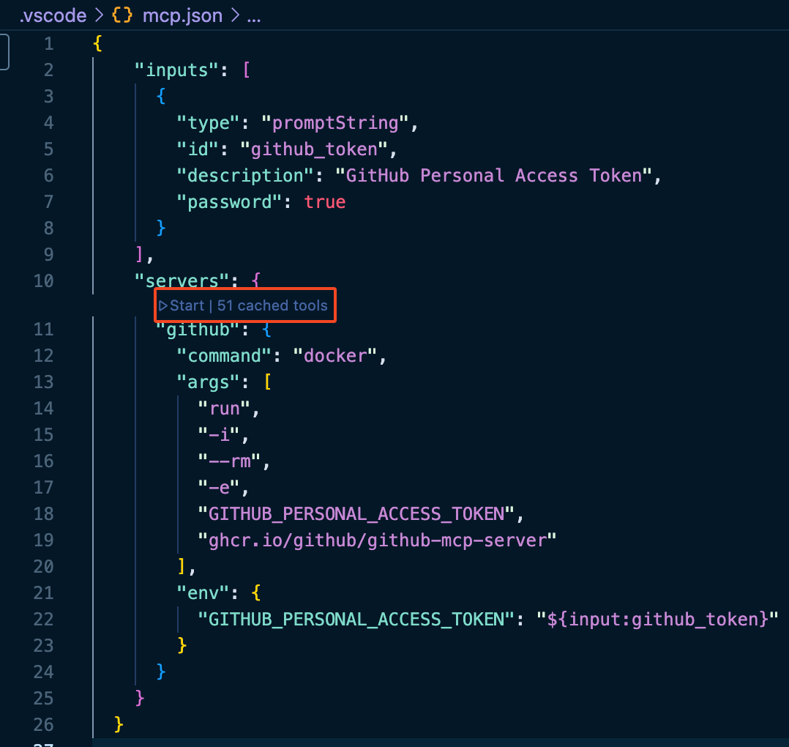

# MCP Start

MCP(Model Context Protocol).  
들어만 보았던 MCP. 이제 직접 사용해 보려고 합니다. 처음에는 진입장벽이 높을 것이라고 생각했지만, 막상 딸깍딸깍 하다보니 생각보다 너무 간단하게 AI를 활용할 수 있다는 것을 느끼게 되었습니다.

자! 그럼 가장 쉽고 빠르게 MCP를 사용해 볼 수 있는 `GitHub MCP`를 사용해 봅시다~!

## MCP

MCP(Model Context Protocol) ⁉️  
MCP는 다양한 인공지능 모델과 도구, 그리고 개발 환경 간의 상호 운용성을 높이기 위해 고안된 표준 프로토콜입니다. MCP는 개발자가 AI 모델, 플러그인, 외부 서비스, 그리고 IDE(ex. VS Code) 등 다양한 컴포넌트들을 손쉽게 연결하고 통합할 수 있도록 설계되었습니다.

주요 특징
- 표준화된 인터페이스: 다양한 AI 모델과 도구가 동일한 방식으로 통신할 수 있도록 표준화된 API와 메시지 포맷을 제공합니다.
- 확장성: 새로운 모델이나 도구를 손쉽게 추가할 수 있으며, 다양한 언어와 플랫폼을 지원합니다.
- 보안: 인증 및 권한 관리 기능을 내장하여 안전하게 외부 서비스와 연동할 수 있습니다.
- 유연한 배포: 로컬 환경, 클라우드, 컨테이너(Docker) 등 다양한 환경에서 MCP 서버를 실행할 수 있습니다.

활용 예시
- VS Code에서 다양한 AI 모델(ex. Copilot, GPT, Claude 등)을 플러그인 형태로 연동
- 외부 API(ex. GitHub, Slack, Jira 등)와 개발 환경의 통합 자동화

## GitHub MCP Server

[GitHub MCP Server](https://github.com/github/github-mcp-server?tab=readme-ov-file#installation)를 사용하는 방법은 README 파일에 작성된 설명만으로도 손쉽게 따라할 수 있습니다.

이 글에서는 다른 MCP Hosts를 사용하지 않고 로컬에 GitHub MCP 서버를 띄워보려고 합니다.  
로컬 컨테이너에서 GitHub MCP 서버를 실행시키기 위해 `Docker` 설치가 필요합니다.  
추가로 VS Code를 사용하여 진행할 것이므로 `VS Code`도  설치가 되어있지 않다면 설치가 필요합니다.

준비물
- Docker
- VS Code + Copilot MCP Extensions 설치
- GitHub Personal Access Token

1️⃣ 이제 VS code를 실행시키고 작업 디렉토리의 루트 경로에 `.vscode` 디렉토리를 생성한 후 `mcp.json` 파일을 작성합니다.

**.vscode/mcp.json**


```json
{
  "inputs": [
    {
      "type": "promptString",
      "id": "github_token",
      "description": "GitHub Personal Access Token",
      "password": true
    }
  ],
  "servers": {
    "github": {
      "command": "docker",
      "args": [
        "run",
        "-i",
        "--rm",
        "-e",
        "GITHUB_PERSONAL_ACCESS_TOKEN",
        "ghcr.io/github/github-mcp-server"
      ],
      "env": {
        "GITHUB_PERSONAL_ACCESS_TOKEN": "${input:github_token}"
      }
    }
  }
}
```

2️⃣ `Copilot Chat`에서 `Agent` 모드로 세팅해 줍니다.
- Command Palette(cmd + shift + p) > `Chat: Open Chat`을 통해 `Copilot Chat` 모드에 진입할 수 있습니다.


3️⃣ 이제 다시 `mcp.json` 파일을 보면 "servers" 하단에 `Start` 라는 실행 버튼이 보이게 됩니다. Click!



4️⃣ GitHub MCP 서버가 정상적으로 실행되었다면 Start 버튼은 `Running | Stop | Restart`으로 대체되고 


도커를 확인해 보면 `trusting_ramanujan`라는 이름의 컨테이너가 실행된 것을 확인할 수 있습니다.
- 컨테이너 이름은 재미난 이름으로 랜덤 생성되고 있습니다. 이것도 AI가 생성해 주는 거겠죠?🧐
- ex. angry beaver, quizzical merkle, kind chaplygin...


5️⃣ 이제 끝입니다.

뭐라우욧 ⁉️ 그렇습니다. 이제 `Copilot Chat`으로 명령만 하면 하라는 대로 다 해줍니다.  
가장 심플하게 "내가 지금 어떤 레파지토리들을 가지고 있는지 찾아줘" 라고 작성해 봅시다.

그럼 착한 Copilot은 "GitHub 토큰을 사용하여 귀하의 GitHub 레포지토리 목록을 확인해보겠습니다."라는 멘트와 함께 로컬에 실행된 Github MCP 서버를 통해 GitHub API 요청이 처리되어 제가 가진 레파지토리 목록을 보여주고 있습니다.

Github MCP 서버를 통해 요청할 수 있는 것은 정말 다양해 보이는데 [Tools](https://github.com/github/github-mcp-server?tab=readme-ov-file#tools)쪽을 보면 확인할 수 있습니다.

그밖에 시도해본 요청들을 나열해 보며 글을 마치려고 합니다.
- "xxx 레파지토리의 aaa 브랜치에 최근 커밋된 커밋 메시지를 알려줘"


## 마치며

기존에는 `GitHub REST API`사용을 위해 문서를 읽어보며 테스트하고 API 요청 코드를 작성하는 등 다양한 작업이 필요했지만 이제 `GitHub MCP Server`를 통해 단 몇 분만에 모든 작업이 가능해졌습니다. Github 말고도 MCP 서버를 제공하는 곳이라면 유사한 방식으로 API 요청을 쉽게 할 수 있게 되었습니다.

기술이 빠르게 발전하는 만큼 저도 발빠르게 사용해 보며 글을 작성하게 되었는데요.  
확실히 들어만 보았을 때와 다르게 직접 사용해 보니 신기하기도 하고 재미있었답니다.  
앞으로도 어떤 AI 기술들이 소개될지.. 걱정반 기대반이랄까요..

## 참고

[Use MCP servers in VS Code (Preview)](https://code.visualstudio.com/docs/copilot/chat/mcp-servers)


